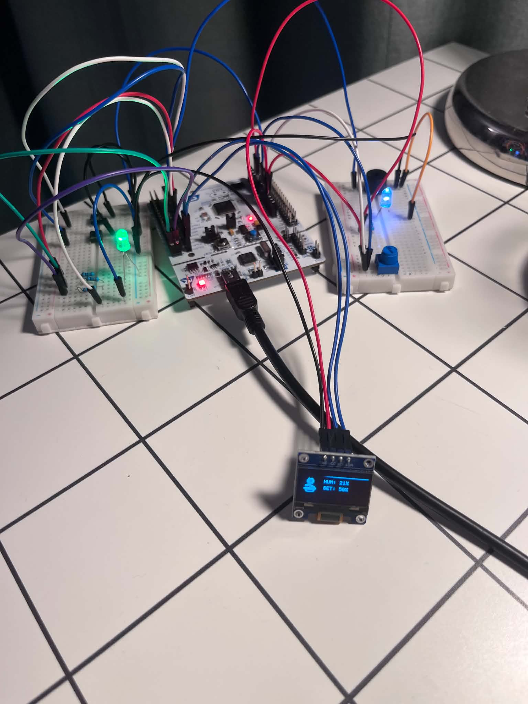
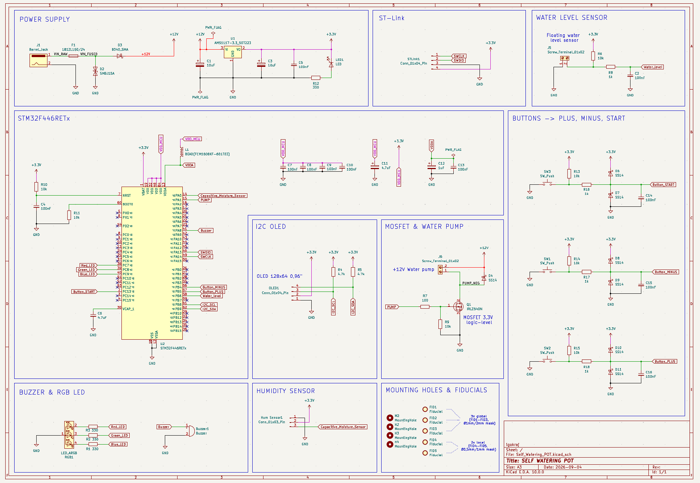
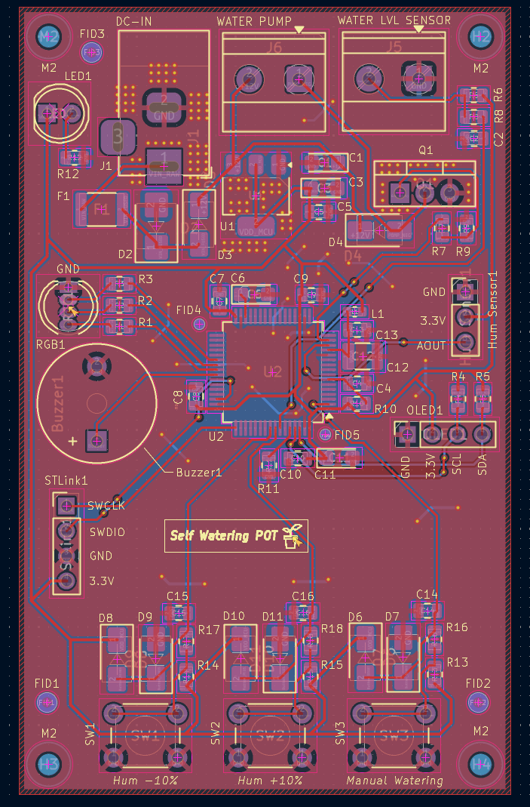
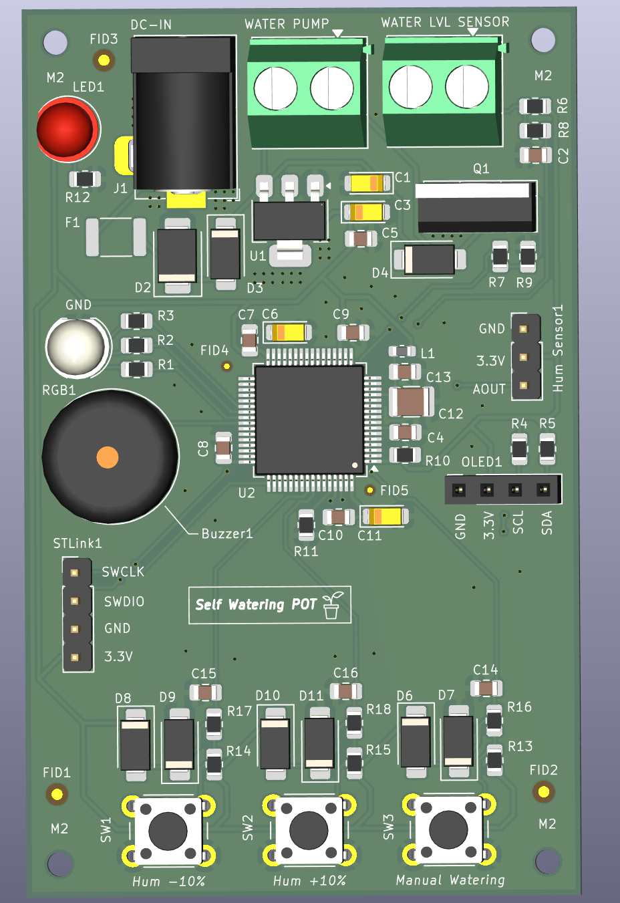
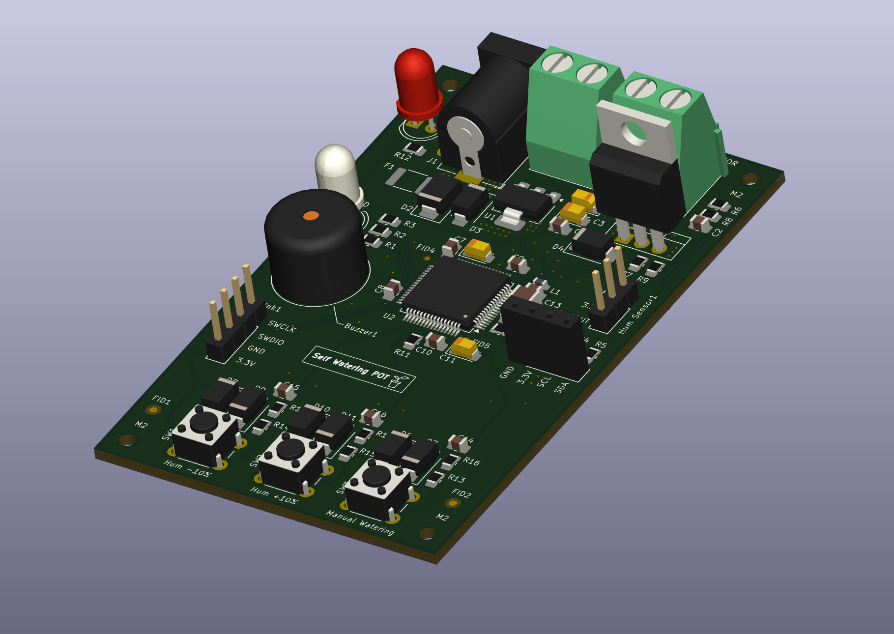

# Self Watering Pot

Projekt zakładał stworzenie automatycznej, samopodlewającej się doniczki na mikrokontrolerze STM32F446RE. Firmware jest napisany w C++. System pilnuje wilgotności gleby i sam włącza pompkę, kiedy gleba robi się za sucha. Da się też wymusić podlewanie ręcznie, a system ma kilka zabezpieczeń na wypadek, gdyby coś poszło nie tak (zaklinowana pompa, uszkodzony czujnik, zawieszony program, pusty pojemnik na wodę).

Do obsługi tego systemu spokojnie można by było użyć mikrokontrolera o mniejszej wydajności, liczbie pinów, pamięci..., jednak ze względu na to, że fizycznie do testowania posiadam jedynie NUCLEO-F446RE, to również na płytce PCB użyłem tego mikrokontrolera dla ujednolicenia projektu. Poniżej zamieszczam zdjęcia prototypu na płytce stykowej (jako zamiennik MOSFETa użyłem diody, symulując jego włączanie/wyłączanie, oraz jako czujnika wilgotności używam ręcznego potencjometru, a do czujnika poziomu wody po prostu kabla, który może być wpięty lub wypięty).

This project set out to build an automatic, self-watering plant pot based on the STM32F446RE microcontroller. The firmware is written in C++. The system keeps an eye on soil moisture and turns the pump on by itself once the soil gets too dry. Watering can also be forced manually, and the system has a few safeguards in case something goes wrong (a stuck pump, a broken sensor, a hung program, an empty water container).

This system would honestly run fine on a much smaller microcontroller which would have a less performance, fewer pins, less memory, but since the only board I physically had for testing was a NUCLEO-F446RE, I used the same chip on the PCB too, just to keep the project consistent. Below are photos of the prototype on a breadboard (I used an LED as a stand-in for the MOSFET, to simulate it switching on/off, a regular potentiometer as a stand-in for the moisture sensor, and for the water level sensor just a loose wire that can be plugged in or pulled out).

## Photos

**Breadboard prototype**

**Schematic**

**PCB layout and 3D render**

  
  
  

## How it works

The system has four states: **Waiting**, **Watering**, **EmptyContainer** (no water in the tank), and **Error**.

In the main loop, the program:

1. reads the water level sensor (float switch),
2. handles the Plus/Minus buttons (adjusts the target humidity by 10% per press, with auto-repeat while held) and the manual start button,
3. reads the soil moisture sensor and converts it to a percentage, checking along the way whether the reading looks like a broken/disconnected sensor,
4. decides the state based on that — with priority: pump fault > broken sensor > empty tank > humidity threshold,
5. drives the LEDs, pump, and buzzer, and shows everything on the OLED screen.

Watering kicks in once humidity drops noticeably (by 15 percentage points). If the pump runs continuously for more than 15 seconds, the system treats it as a fault, shuts the pump off for good, and requires a manual reset via the Start button — the buzzer beeps 3 times during this, repeating once a minute.

Holding the Manual Start button forces watering regardless of what the sensor reads.

## Peripherals / electronics

- **STM32F446RETx** — microcontroller
- **Soil moisture sensor** (capacitive) — ADC input
- **Water level sensor** (float switch) — a plain switch
- **3× buttons** — Manual Start, Plus, Minus
- **RGB LED** — indicates system state by color
- **Buzzer** — audible alarm on error
- **Water pump** driven by a MOSFET (IRLZ540N)
- **128×64 OLED display** (SSD1306) over I2C
- **AMS1117-3.3** — 3.3V voltage regulator
- Power connector (barrel jack) with a fuse and overvoltage protection
- SWD connector (ST-Link) for programming/debugging

## BOM (short version)

| Reference      | Component                                                             | Qty |
| --------------- | --------------------------------------------------------------------- | --- |
| U2              | STM32F446RETx                                                         | 1   |
| U1              | AMS1117-3.3 (3.3V regulator)                                          | 1   |
| Q1              | IRLZ540N (MOSFET, pump switch)                                        | 1   |
| RGB1            | RGB LED                                                                | 1   |
| LED1            | LED (status)                                                          | 1   |
| Buzzer1         | Buzzer                                                                 | 1   |
| SW1–SW3         | Buttons (Start/Plus/Minus)                                            | 3   |
| J1              | Power jack (barrel jack)                                               | 1   |
| J5, J6          | Screw terminals (pump, external power)                                | 2   |
| Hum Sensor1     | Moisture sensor connector                                              | 1   |
| OLED1           | OLED display connector                                                 | 1   |
| STLink1         | Programmer connector                                                   | 1   |
| F1              | Fuse                                                                    | 1   |
| D2              | TVS diode (overvoltage protection)                                     | 1   |
| D3, D4, D6–D11  | Schottky diodes                                                        | 8   |
| L1              | Ferrite bead (power filtering)                                         | 1   |
| R, C            | Resistors and capacitors (filtering, pull-up/down, debounce circuits) | ~30 |

The full list (with LCSC part numbers) is in `hardware/Self_Watering_POT/BOM.xlsx` and `All_BOM.xlsx`.

## Firmware

The code is written in **C++** (built on top of the C code generated by STM32CubeMX/HAL). The pot's state logic, debounced button handling, OLED display, and buzzer are written as separate classes/modules — the rest (ADC, timer, GPIO, watchdog) is the generated HAL layer.

## Repo structure

- `firmware/` — CMake project with the STM32 sources
- `hardware/` — KiCad schematic and PCB, production files (Gerbers), BOM
- `Images/` — project photos and renders
